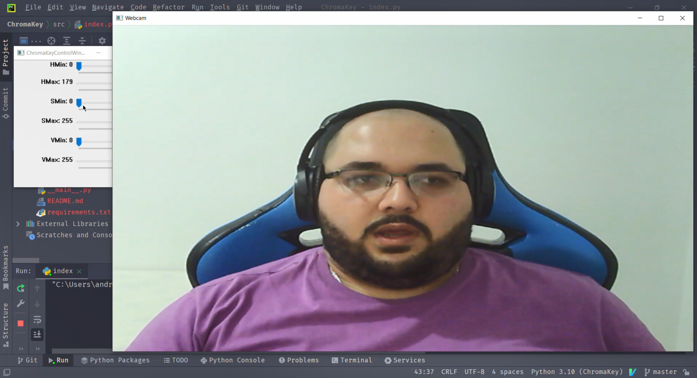
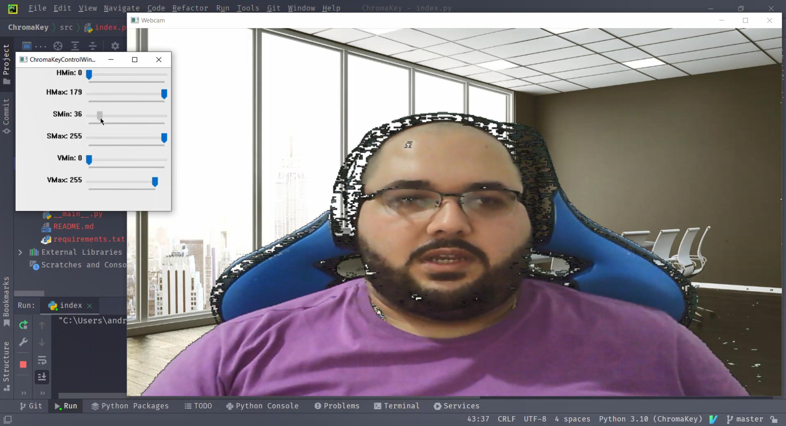

# Projeto de C209 - Chromakey
A proposta do projeto é remover o fundo do vídeo de uma webcam e substituir por um papel de parede.
Isso tem uma grande utilidade, especialmente nesses tempos de pandemias, em que as pessoas fazem muitas reuniões de casa e muitas vezes é interessante remover o fundo por questão de privacidade.

Essa é a imagem antes da aplicação da técnica:

E esse é um possível resultado após a aplicação da técnica:

É possível notar alguns ruídos na imagem.

Essa técnica elimina todos os pixels que não estão entre os limites inferiores e superiores das componentes.
Com isso, algum pixel que seja parte da imagem do rosto da pessoa pode ser removido.

Uma outra técnica de chroma-key consiste em definir uma determinada cor e uma faixa de tolerância, 
e todos os pixels que estão dentro dessa faixa são removidos. Essa técnica tende a apresentar resultados melhores
do que aquela, mas ela é mais sensível a iluminação e uniformidade do plano de fundo.

## Como executar

1. Clone este repositório para a sua máquina;
2. Recomenda-se usar o _Python 3.10_;
3. Criar uma venv para instalar as dependências **open cv** e **numpy**; 
4. Após criá-la e ativá-la, deve-se executar o comando abaixo:
  <code>
pip install -r requirements.txt
</code> 
5. Rodar <code>index.py</code> através da IDE ou pela linha de comando:
 <code>python -m src/index.py</code> 